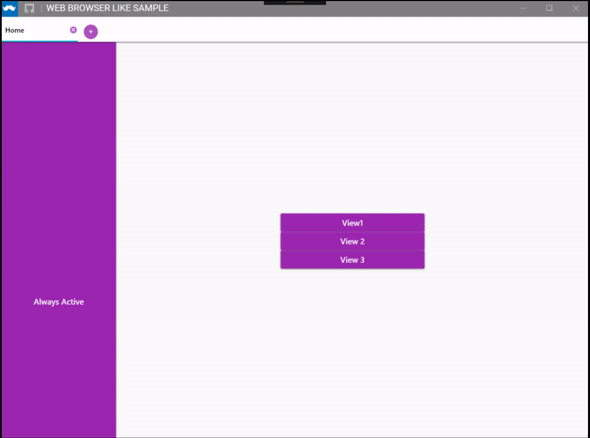

# Web-Browser-Like-WPF-App
A WPF app that resembles a web browser. Good practices aren't implemented so beware!

It uses Prism.DryIoc, Dragablz, MaterialDesignInXaml and MahApps.Metro Window.

Remember to restore nuget packages before using it!

# What you'll find:

This example is based on: https://github.com/svantreeck/DragablzPrism so i reccomend checking that before.

- MainWindow.Xaml/.cs:
  - Mix metro Window with Material design.
  - Some styling of the Dragablz Material Design style, using the official style from MaterialDesignInXaml as a starting point. Here the most important change is that i added a command and a event to the ((+) add new tab) button, so ican do some logic when the button is pressed in both the viewmodel and code-behind. I did it because i wasn't able to use Dragablz NewItemFactory, so you may not need this change if you know how to use it.
  - Using a CustomTabablzControl, so i can bind the command previously mentioned.
  
- Added an IActiveAware interface which is hooked to the viewmodels in TabablzRegionBehavior.cs. VM that implement this interface will know when they gain and loss focus when they're part of a TabablzControl region. Useful to solve a bug with Dialog Modals in MaterialDesign while using Dragablz. Note: The bug consists on the modal still being shown even when the tab loses focus/is deactivated.

There are more straightforward changes that shouldn't be a problem to get. Happy Coding!
